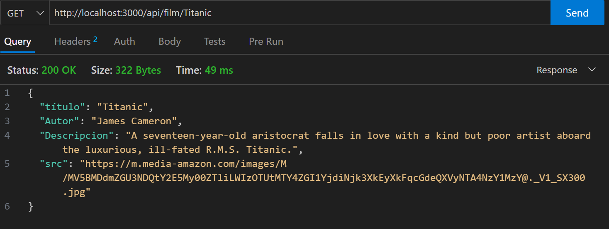
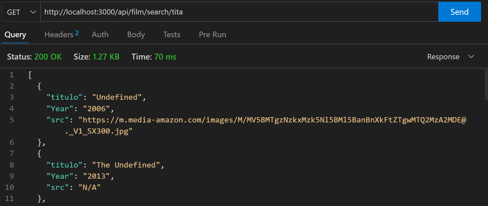
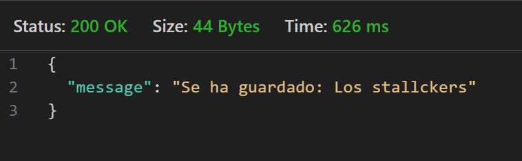
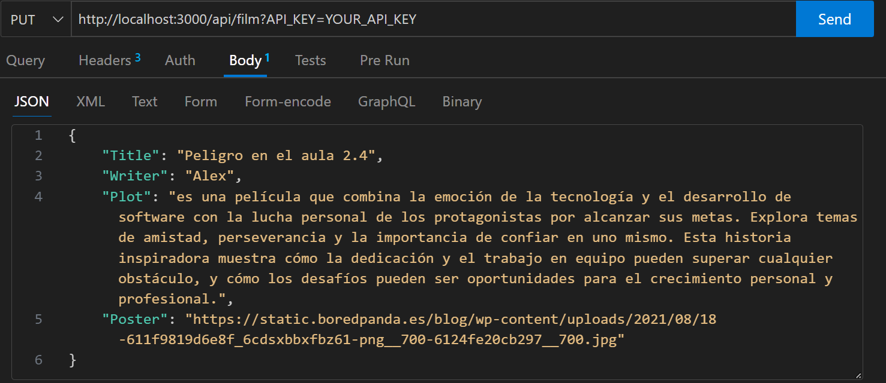
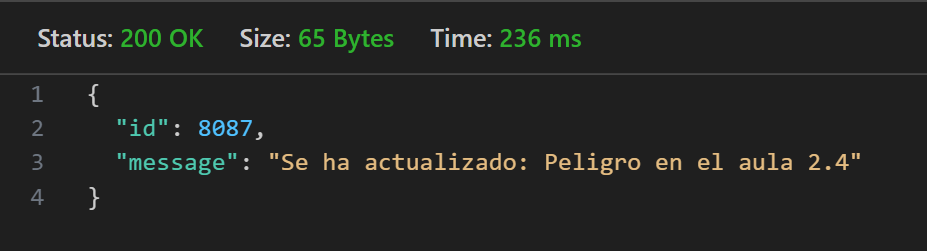
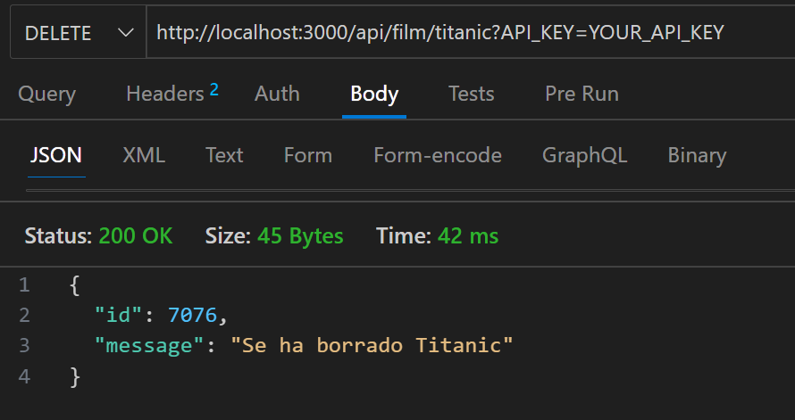

# API-REST-Film
Welcome to API-REST-Film! This README file will provide you with an overview of the API, its features, how to use it, and other important information.
<br>
<br>

## API Base URL
The base URL for accessing the API is: http://localhost:3000/api/film
<br>
<br>

### Introduction

The API-REST-Film is an API for managing a collection of movies. It provides endpoints to retrieve, search, create, update, and delete movies.
<br>
<br>
### Getting Started
Prerequisites
To use this API, you will need:

  1. Ensure that you have a local development environment set up with Node.js and npm installed.
  2. Make sure you have an API key for authentication purposes. 
  3. TEST_API_KEY=dh189cv27
<br>
<br>

### Installation:

  1. Clone the API-REST-Film repository to your local machine.
  2. Navigate to the project directory.
  3. Run the following command to install the dependencies:
<br>

```
npm install
```
<br>

### Configuration:

  - Open the project directory and locate the .env file.
  - Replace YOUR_API_KEY in the .env file with your actual API key.
  - Save the changes

### Starting the API:

In the project directory, run the following command to start the API server:
<br>
```
npm run dev
```
<br>
The API will be accessible at http://localhost:3000/api/film.
<br>
<br>

### Using the API:

  - You can send HTTP requests to the API using tools like cURL, Postman, or any programming language's HTTP library.
  - Refer to the provided endpoints in the API's README file for the available routes and their functionalities.
  - Use the appropriate HTTP methods (GET, POST, PUT, DELETE) and URLs to interact with the API.
  - Include your API key in the request URL for authentication when necessary.

### Examples:
<br>

1. To get information about a movie with the title "Titanic", send a GET request to 
  ```
  http://localhost:3000/api/film/Titanic
  ```
<br>
request and result:

<br>

[](/README.md)
<br>
<br>
___
<br>

2. To search for movies containing the keyword "tita", send a GET request to 

```
http://localhost:3000/api/film/search/tita
```

<br>
request and result:

<br>

[](/README.md)
<br>
<br>
___
<br>

3. To create a new movie, send a POST request to 
```
http://localhost:3000/api/film?API_KEY=YOUR_API_KEY
```

<br>
request:

  with the movie details in the request body as JSON.
<br>

[](/README.md)
<br>
<br>

  result
<br>

[](/README.md)
<br>
<br>
___
<br>

4. To update an existing movie, send a PUT request to 
```
http://localhost:3000/api/film?API_KEY=YOUR_API_KEY
```

<br>
request:

  with the updated movie details in the request body as JSON.
<br>

[](/README.md)
<br>
<br>

  result
<br>

[](/README.md)
<br>
<br>
___
<br>

5. To delete the movie with the title "Titanic", send a DELETE request to 

```
http://localhost:3000/api/film/titanic?API_KEY=YOUR_API_KEY.
```

<br>
request and results:
<br>

[](/README.md)
<br>
<br>

Remember to replace YOUR_API_KEY with your actual API key in the request URLs that require authentication.
<br>
That's it! You can now use the API-REST-Film to manage movies by sending HTTP requests to the provided endpoints, Happy Coding!!!.
<br>
<br>
___

<br>

[](https://www.gromarant.com/)
<br>
[&copy; Mariangelica Rodriguez](https://www.linkedin.com/in/mariangelica-rodr%C3%ADguez-p%C3%A9rez/)
